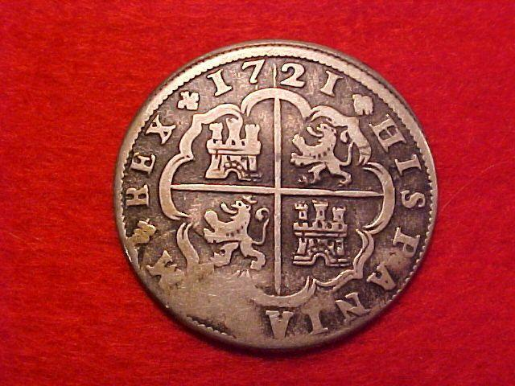

# Démo Quarto

Article en format HTML axé sur les tableaux et les graphiques avec la langage R. Bouton droit vers: <a href="https://ugolabo.github.io/demo_quarto_article_html_pdf_graphiques/" target="_blank">site</a>. C'est le fichier 'index.html'.

Résultats de courses de pigeons.  
Production d'argent par les Espagnols en Amérique du Sud à l'époque coloniale (1720 - 1800).
